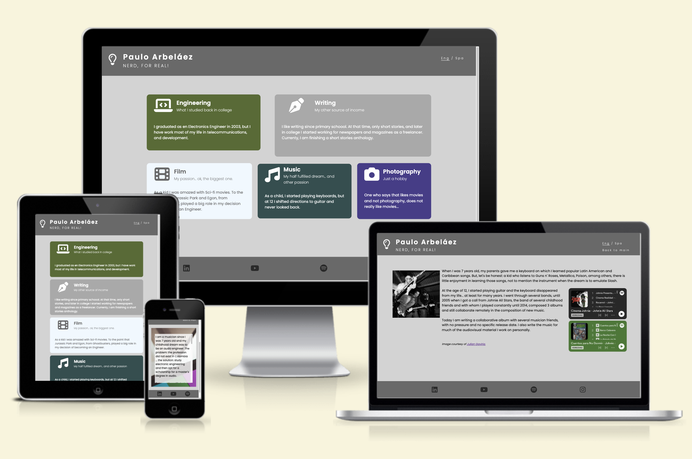
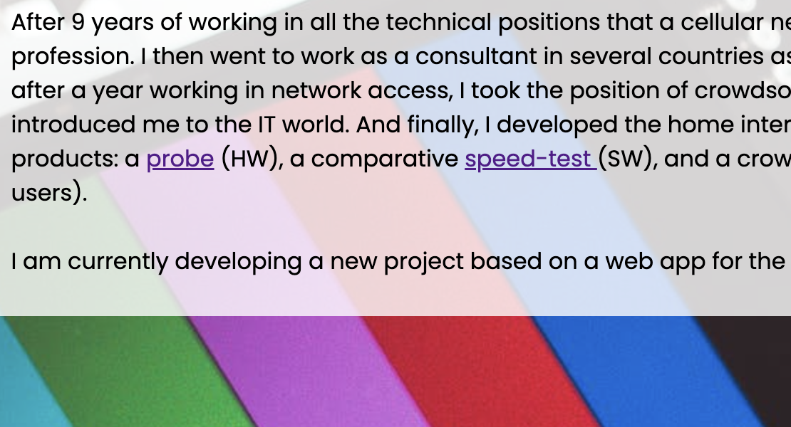
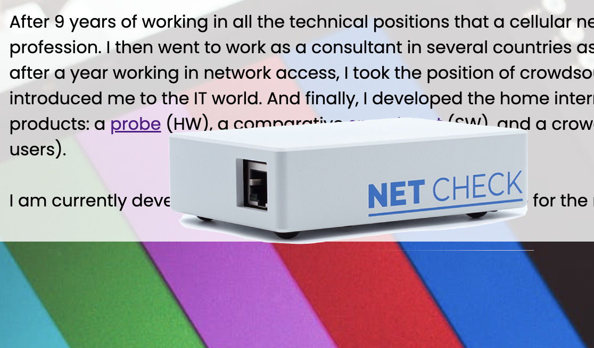

Welcome to my portfolio,

It is difficult for me to correctly show all my capabilities in a single CV, therefore, I decided to create a portfolio with all my working experience and hobbies with which I can make a living, or could be useful for the visitirs of the webpage interests.

[View My Portfolio on Github Pages](https://parbelaez.github.io/p1-html-css/)

## Concept for the UI / UX

As the portfolio is really eclectic, it should be as clear and simple as possible.

The logo was inspired by an AI generated one, from [LOOKA](https://looka.com/), but created totally manual using Google fonts and [Fontawesome](https://fontawesome.com/) icons

The color scheme is based on differnt shades of grey, with the exception of the tiles, that were thought as pastel, so their inherent opacity match the seriousness of the header and the footer.

### Fonts

Google fonts was the source of the typography:

[Poppins](https://github.com/itfoundry/poppins): is a geometric sans serif typeface developed by Indian Type Foundry and Jonny Pinhorn.

### Icons and images

Icons were used directly from [Fontawesome](https://fontawesome.com/).

Images were obatained from my personal archive and [Pexels](https://www.pexels.com/)

---

## Content Pages

### index.html -landing page-

I chose to use a tiling system in the index to be similar to a mobile app, with an icon, title, catch phrase, and a brief description. And, that's the main reason behind the des¡cision to use a back to menu button, instead of a list of links.

The footer is composed as well of icons of my normally used social networks the could help the user knowing more about my work.

### Engineering

This one was used to practice the usage of the background image, and the hover displaying and image on the word: probe.

#### Used Technologies

All the previous, plus some snippet from [Codepen](https://codepen.io/wall-e/pen/zvvgBe).

### Writing

This is an only text webpage. It is not meant to have more information than that until the book is published or the scripts are ready.

### Film

For this page, YouTube iframes were used, so the visitor can check part of my multimedia work.

### Music

For this page, Spotify iframes were used, along with a copyrighted photo with its correspondent mention.
Some audio clips can be inserted in the future, as the work on the album progresses.

### Photography

A set of personal photos. Some of them are not part of my Instagram acount.
Flexbox was used to create the matrix.

- - -

## Deployment & Local Development

### Deployment

Github Pages was used to deploy the live website. The instructions to achieve this are below:

1. Log in (or sign up) to Github.
2. Find the repository for this project, p1-html-css.
3. Click on the Settings link.
4. Click on the Pages link in the left hand side navigation bar.
5. In the Source section, choose main from the drop down select branch menu. Select Root from the drop down select folder menu.
6. Click Save. Your live Github Pages site is now deployed at the URL shown.

### Development

All development was done in [Code Anywhere](https://app.codeanywhere.com/).

### Local Development

No local development was carried out.

#### How to Fork

To fork the p1-html-css repository:

1. Log in (or sign up) to Github.
2. Go to the repository for this project, parbelaez/p1-html-css.
3. Click the Fork button in the top right corner.

#### How to Clone

To clone the p1-html-css repository:

1. Log in (or sign up) to GitHub.
2. Go to the repository for this project, parbelaez/p1-html-css.
3. Click on the code button, select whether you would like to clone with HTTPS, SSH or GitHub CLI and copy the link shown.
4. Open the terminal in your code editor and change the current working directory to the location you want to use for the cloned directory.
5. Type 'git clone' into the terminal and then paste the link you copied in step 3. Press enter.

- - -

## Bug report and errors

### Known bugs

None so far

### Fixed bugs

- Images not loading due to wrong path.
- a attributes given mistakenly to the img contained in it.
- Resizing issues due to min-max height threshold not defined.

### Errors

* The w3c html validation is considered as OK, as the errors are coming directly from the iframes given by the YouTube and Spotify codes.

YouTube: *"Error: The frameborder attribute on the iframe element is obsolete. Use CSS instead."*

Spotify: *"Error: Bad value 100% for attribute width on element iframe: Expected a digit but saw % instead.*